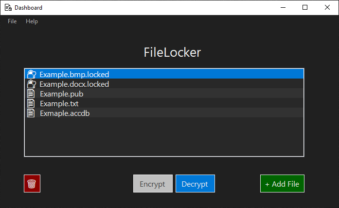
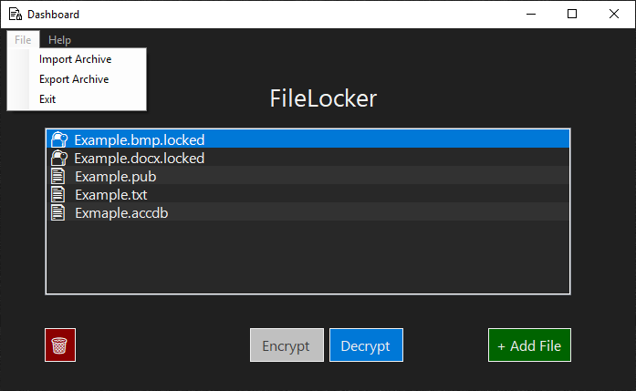
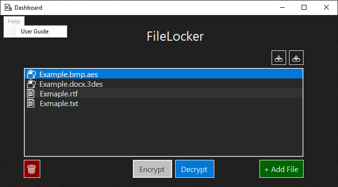
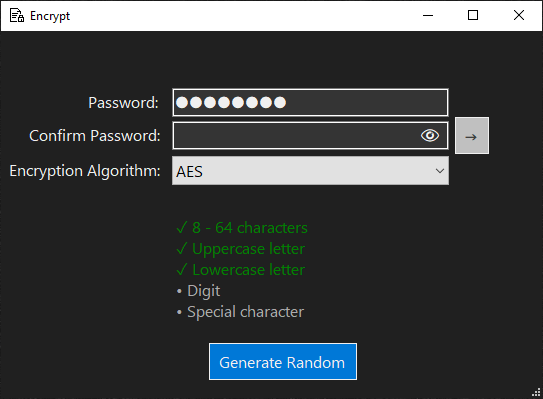
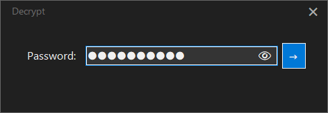

# FileLocker

FileLocker is a Windows desktop application designed protect files in rest or in transit using security best practices.

## Table of Contents

1. [Getting Started](#getting-started)
   - [Download](#download)
   - [Installation](#installation)
2. [User Guide](#user-guide)
   - [Dashboard Form](#dashboard-form)
   - [Encrypt Form](#encrypt-form)
   - [Decrypt Form](#decrypt-form)
3. [Technologies](#technologies)
4. [Security Features](#security-features)

## Getting Started

### Download

_Coming Soon_

### Installation

_Coming Soon_

## User Guide

### Dashboard Form

The Dashboard Form displays what files are currently within FileLocker's scope. Each file's status can be seen to the left of its name. 🔐 means the file is locked, and 📄 means the file is unlocked. Multiple files can be selected for encryption.

- **+ Add File**: displays a file dialog to select one or more files to be displayed.
- **Encrypt**: launches the [**Encrypt Form**](#encrypt-form).
- **Decrypt**: launches the [**Decrypt Form**](#decrypt-form).
- **🗑️**: shreds a file by overwriting its contents with random data and then deleting.
- **List Panel**: right click on a file to display options.

### Tabs

- **File Tab**: displays a menu with the following options:

  - Import Archive: allows selection a file archive to load.
  - Export Archive: exports the currently selected file archive. Only one file may be exported at a time.
  - Exit: terminates the app.

- **Help Tab**:

  - User Guide: opens the GitHub repository in the default browser.

---

### Encrypt Form

The Encrypt Form allows users to choose an industry-standard encryption algorithm such as AES and 3DES and provide a strength-enforced password.

- **Generate Random**: generates a random password that satisfies the strength policy.
- **→**: encrypts the file with the provided password.
- **👁**: shows or hides the password fields.

---

### Decrypt Form

The Decrypt Form allows users to input the password they used to encrypt.

- **→**: decrypts the file with the provided password, if correct.
- **👁**: shows or hides the password.

## Technologies

- **OS**: Windows
- **IDE**: Visual Studio
- **Programming Language**: C#
- **Framework**: .NET
- **UI**: Windows Forms
- **Version Control**: Git / GitHub
- **Encryption Algorithm**: AES
- **MAC Algorithm**: HMACSHA256
- **Key Derivation Algorithm**: PBKDF2
- **Logging Library**: Serilog
- **Unit Testing Library**: xUnit

## Security Features

- **Confidentiality**: Encrypts files with AES or 3DES.
- **Integrity**: Generates HMACs to ensure the integrity of stored or transmitted data.
- **Password Strength Policy**: Sets a strong password to mitigate brute-force attacks.
- **Password Generator**: Generates a password without the need to manually type, mitigating the effect of keystroke logging malware.
- **Password Management**: Hashes and salts passwords to protect against rainbow table attacks.
- **Password-Based Key Derivation**: Derives encryption keys from passwords.
- **Logging**: Logs important events such as encryption and decryption with Serilog.
- **Constant-Time Comparison**: Uses libraries with constant-time comparison to mitigate timing attacks.
- **File Shredder**: Deletes files without leaving traces by overwriting with random data.
- **Customizable Encryption**: Allows selection of different encryption algorithms.
- **SOLID Principles**: Follows SOLID principles to facilitate quick code updates in the case of a new exploit.
