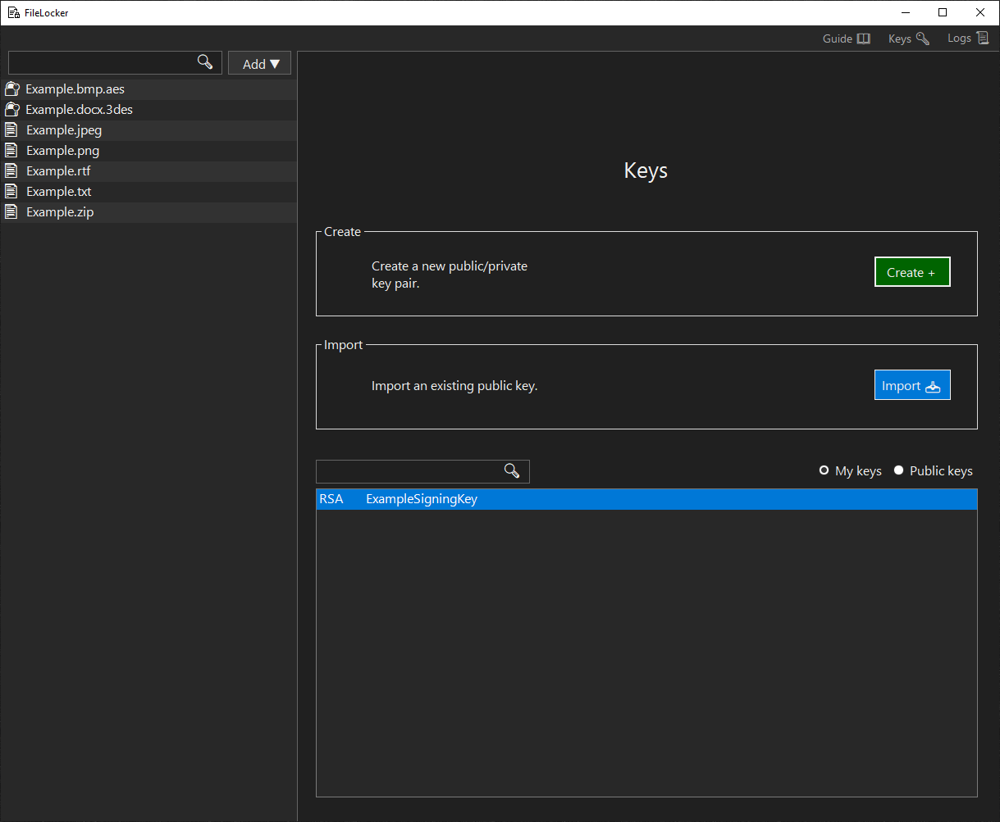

# FileLocker

A Windows desktop app for cryptographically protecting files using symmetric and asymmetric techniques.

## Table of Contents

1. [Getting Started](#getting-started)
2. [Guide](#guide)
3. [Technologies](#technologies)
4. [Security Features](#security-features)

## Getting Started

<details>
<summary><strong>Run from executable</strong></summary>

1. Download [FileLocker.exe](https://github.com/EvanHei/FileLocker/releases/download/v1.0.1/FileLocker.exe) (SHA256 below)

   ```SHA256
   af609e3f97af864e44cdee241bad2fe951c7758d2393b2226c9b0f5724b4df53
   ```

2. Double-click FileLocker.exe, click "More info", and then click "Run anyway". This prompt will disappear the next time FileLocker is run.

   

</details>

<details>
<summary><strong>Run from source code</strong></summary>

1. Download the .NET SDK from Microsoft's website <a href="https://dotnet.microsoft.com/download"> here</a> or verify installation by running the following command:

   ```bash
   dotnet --version
   ```

2. Navigate to FileLocker/WinFormsUI/ and launch with the following command:

   ```bash
   dotnet run
   ```

</details>

## Guide

### Dashboard Form

<details>
<summary><strong>Summary</strong></summary>
The Dashboard Form displays files added to FileLocker's scope, allows addition of files, provides a key generation service, and log navigation feature.

- **Guide 📖**: opens the GitHub repository in the default browser.
- **Keys 🔑**: displays the key panel.
- **Logs 📜**: displays the log panel.
- **Add ▼**: shows dropdown options to add files to the scope by manually selecting or importing an archive.
- **File List**: right click on a file to display options or drag and drop files onto the list to add them.
- **Search Box**: filters files based on the search query. Filter by file type by searching `.txt` or `.png`, or filter by algorithm by searching `.aes` or `.3des`.


</details>

<details>
<summary><strong>Locked File Panel</strong></summary>
A locked file can be decrypted, shredded, shown in File Explorer, or exported.

- **📋 Path**: copies the path to the clipboard.
- **📋 SHA**: copies the SHA to the clipboard.
- **Decrypt 🔑**: opens the Decrypt Form.
- **Shred 🗑️**: shreds the file by overwriting its contents with random data and then deleting.
- **Explorer 📁**: launches File Explorer with the file selected.
- **Export 📤**: exports the file to a .zip archive.


</details>

<details>
<summary><strong>Unlocked File Panel</strong></summary>
An unlocked file can be encrypted, shredded, or shown in File Explorer.

- **📋 Path**: copies the path to the clipboard.
- **📋 SHA**: copies the SHA to the clipboard.
- **Encrypt 🔐**: opens the Encrypt Form.
- **Shred 🗑️**: shreds the file by overwriting its contents with random data and then deleting.
- **Explorer 📁**: launches File Explorer with the file selected.


</details>

<details>
<summary><strong>Moved/Deleted File Panel</strong></summary>
An moved or deleted file can be relocated or removed from scope.

- **Relocate**: find the moved file.
- **Remove**: remove file from scope.


</details>

<details>
<summary><strong>Keys Panel</strong></summary>
Keys pairs can be created and public keys can be imported.

- **Create**: opens the Create Key Pair Form.
- **Import**: imports a selected public key archive.
- **Key Lists**: right click on a key to display options.


</details>

<details>
<summary><strong>Logs Panel</strong></summary>
Logs can be viewed and navigated using the various filters.

- **Level**: filter by log level.
- **All time**: display all logs.
- **Last Month**: display logs within the last month.
- **Last Week**: display logs within the last week.
- **Last Day**: display logs within the last day.
- **Search Box**: filters logs based on the search query.


</details>

---

<details>
<summary><strong>Encrypt Form</strong></summary>


The Encrypt Form allows encryption by choosing an industry-standard encryption algorithm such as AES or 3DES and providing a strength-enforced password. Password fields are cleared after 30 seconds of inactivity.

- **Generate Random**: generates a random password that satisfies the strength policy.
- **Clear**: erases both password fields.
- **→**: encrypts the file with the provided password. If lost, the file cannot be decrypted. FileLocker maintains a zero-knowledge policy.
- **👁**: shows or hides the password fields.

</details>

---

<details>
<summary><strong>Decrypt Form</strong></summary>


The Decrypt Form allows decryption by providing the encryption password. Password field is cleared after 30 seconds of inactivity.

- **→**: decrypts the file with the provided password, if correct.
- **👁**: shows or hides the password fields.
</details>

---

<details>
<summary><strong>Import Form</strong></summary>


The Import Form allows an import of a .zip archive.

- **Open**: choose a .zip archive.
- **Save To**: the location where the file will be saved.
- **Import**: loads the archive and saves the file to the chosen location.
</details>

---

<details>
<summary><strong>Create Key Pair Form</strong></summary>


The Create Key Pair Form allows creation of a public/private key pair.

- **Generate Random**: generates a random password that satisfies the strength policy.
- **Clear**: erases both password fields.
- **→**: creates the key pair and encrypts the private key with the provided password. If lost, the key cannot be used to sign. FileLocker maintains a zero-knowledge policy.
- **👁**: shows or hides the password fields.

</details>

---

## Technologies

- **OS**: Windows
- **IDE**: Visual Studio
- **Programming Language**: C#
- **Framework**: .NET
- **UI**: Windows Forms
- **Version Control**: Git / GitHub
- **Algorithms**: AES, 3DES, HMACSHA256, PBKDF2, RSA, ECDSA
- **Logging**: Serilog
- **Unit Testing**: xUnit

## Security Features

- **Confidentiality**: AES and 3DES encryption.
- **Integrity**: HMAC integrity checks of stored and transmitted data.
- **Password Strength Policy**: strong passwords mitigate brute-force attacks.
- **Password Generation**: passwords generated without the need to manually type, mitigating the effect of keystroke logging malware.
- **Password Management**: password inputs cleared after a set time if the device is left running.
- **Password-Based Key Derivation**: encryption keys derived from passwords.
- **Logging**: important events logged such as encryption and decryption.
- **Constant-Time Comparison**: libraries use constant-time comparison to mitigate timing attacks.
- **File Shredding**: files deleted without leaving traces by overwriting with random data.
- **SOLID Principles**: facilitate quick code updates in the case of a new exploit.
