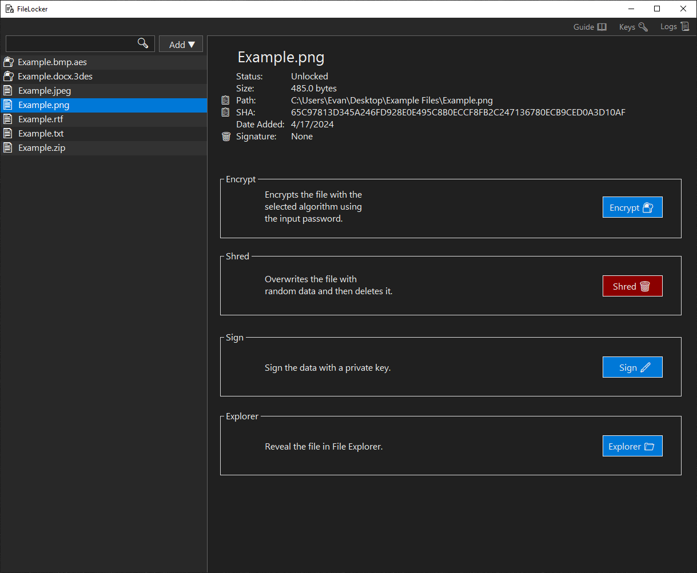

# FileLocker

A Windows desktop app to protect files in rest or in transit using cryptographic techniques and cybersecurity best practices.

## Table of Contents

1. [Getting Started](#getting-started)
   - [Download](#download)
   - [Installation](#installation)
2. [User Guide](#user-guide)
   - [Dashboard Form](#dashboard-form)
   - [Encrypt Form](#encrypt-form)
   - [Decrypt Form](#decrypt-form)
3. [Technologies](#technologies)
4. [Security Features](#security-features)

## Getting Started

### Download

_Coming Soon_

### Installation

_Coming Soon_

## User Guide

### Dashboard Form

#### Locked File Selected

A locked file can be decrypted, shredded, shown in File Explorer, or exported.

- **📋 Path**: copies the path to the clipboard.
- **📋 SHA**: copies the SHA to the clipboard.
- **Decrypt 🔑**: opens the [**Decrypt Form**](#decrypt-form).
- **Shred 🗑️**: shreds the file by overwriting its contents with random data and then deleting.
- **Explorer 📁**: launches File Explorer with the file selected.
- **Export 📤**: exports the file to a .zip archive.

---

#### Unlocked File Selected

An unlocked file can be encrypted, shredded, or shown in File Explorer.

- **📋 Path**: copies the path to the clipboard.
- **📋 SHA**: copies the SHA to the clipboard.
- **Encrypt 🔐**: opens the [**Encrypt Form**](#encrypt-form).
- **Shred 🗑️**: shreds the file by overwriting its contents with random data and then deleting.
- **Explorer 📁**: launches File Explorer with the file selected.

---

#### Moved/Deleted File Selected

An moved or deleted file can be relocated or removed from scope.

- **Relocate**: find the moved file.
- **Remove**: remove file from scope.

---

The Dashboard Form also displays files within FileLocker's scope and allows addition and navigation of files.

- **Guide 📖**: opens the GitHub repository in the default browser.
- **Diagnostics 📊**: _Coming Soon_
- **Settings ⚙**: _Coming Soon_
- **Add ▼**: shows dropdown options to add files to the scope by manually selecting or importing an archive.
- **File List**: right click on a file to display options or drag and drop files onto the list to add them.
- **Search Bar**: filters files based on the search query.

> [!TIP]
> Filter by file type by searching `.txt` or `.png`, or filter by algorithm by searching `.aes` or `.3des`.

---

### Encrypt Form

The Encrypt Form allows encryption by choosing an industry-standard encryption algorithm such as AES or 3DES and providing a strength-enforced password. Password fields are cleared after 30 seconds of inactivity.

- **Generate Random**: generates a random password that satisfies the strength policy.
- **Clear**: erases both password fields.
- **→**: encrypts the file with the provided password.
- **👁**: shows or hides the password fields.

> [!CAUTION]
> If the password is lost the file cannot be decrypted. FileLocker maintains a zero-knowledge policy.

---

### Decrypt Form

The Decrypt Form allows decryption by providing the encryption password. Password field is cleared after 30 seconds of inactivity.

- **→**: decrypts the file with the provided password, if correct.
- **👁**: shows or hides the password fields.

---

### Import Form

The Import Form allows an import of a .zip archive.

- **Open**: choose a .zip archive.
- **Save To**: the location where the file will be saved.
- **Import**: loads the archive and saves the file to the chosen location.

## Technologies

- **OS**: Windows
- **IDE**: Visual Studio
- **Programming Language**: C#
- **Framework**: .NET
- **UI**: Windows Forms
- **Version Control**: Git / GitHub
- **Encryption Algorithm(s)**: AES, 3DES
- **MAC Algorithm**: HMACSHA256
- **Key Derivation Algorithm**: PBKDF2
- **Logging Library**: Serilog
- **Unit Testing Library**: xUnit

## Security Features

- **Confidentiality**: Encrypts files with AES or 3DES.
- **Integrity**: Generates HMACs to ensure the integrity of stored or transmitted data.
- **Password Strength Policy**: Sets a strong password to mitigate brute-force attacks.
- **Password Generator**: Generates a password without the need to manually type, mitigating the effect of keystroke logging malware.
- **Password Management**: Clears password inputs after a set time if the device is left running.
- **Password-Based Key Derivation**: Derives encryption keys from passwords.
- **Logging**: Logs important events such as encryption and decryption with Serilog.
- **Constant-Time Comparison**: Uses libraries with constant-time comparison to mitigate timing attacks.
- **File Shredder**: Deletes files without leaving traces by overwriting with random data.
- **Customization**: Allows selection of different encryption algorithms.
- **SOLID Principles**: Follows SOLID principles to facilitate quick code updates in the case of a new exploit.
