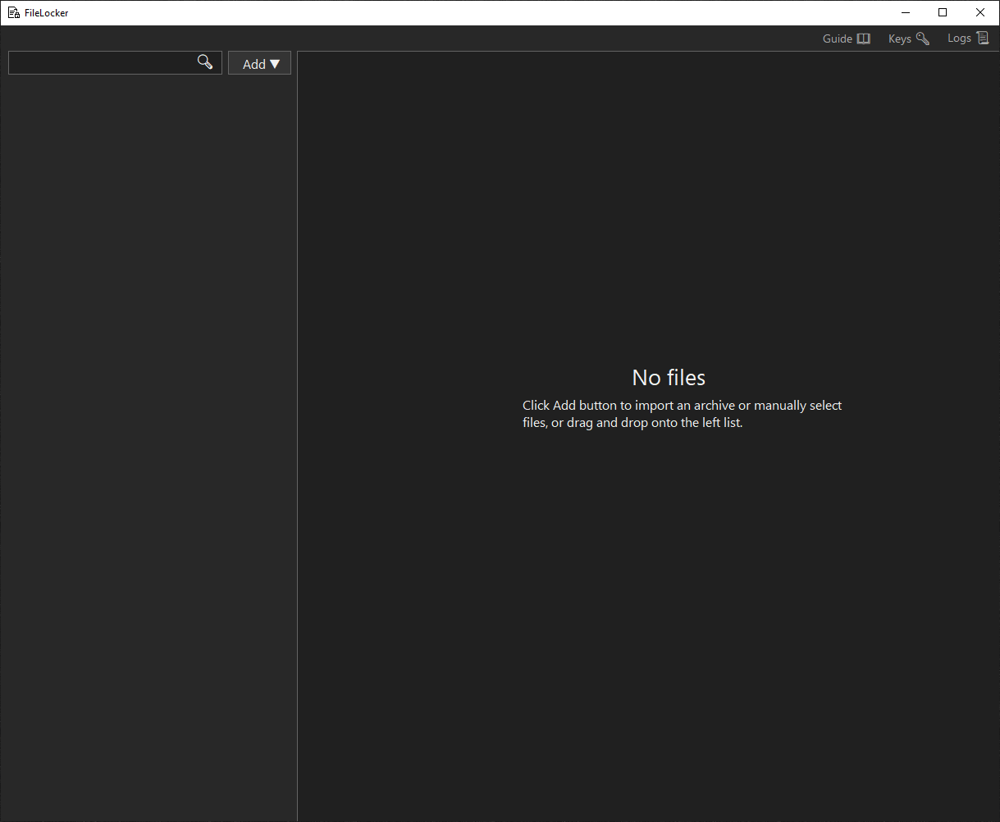
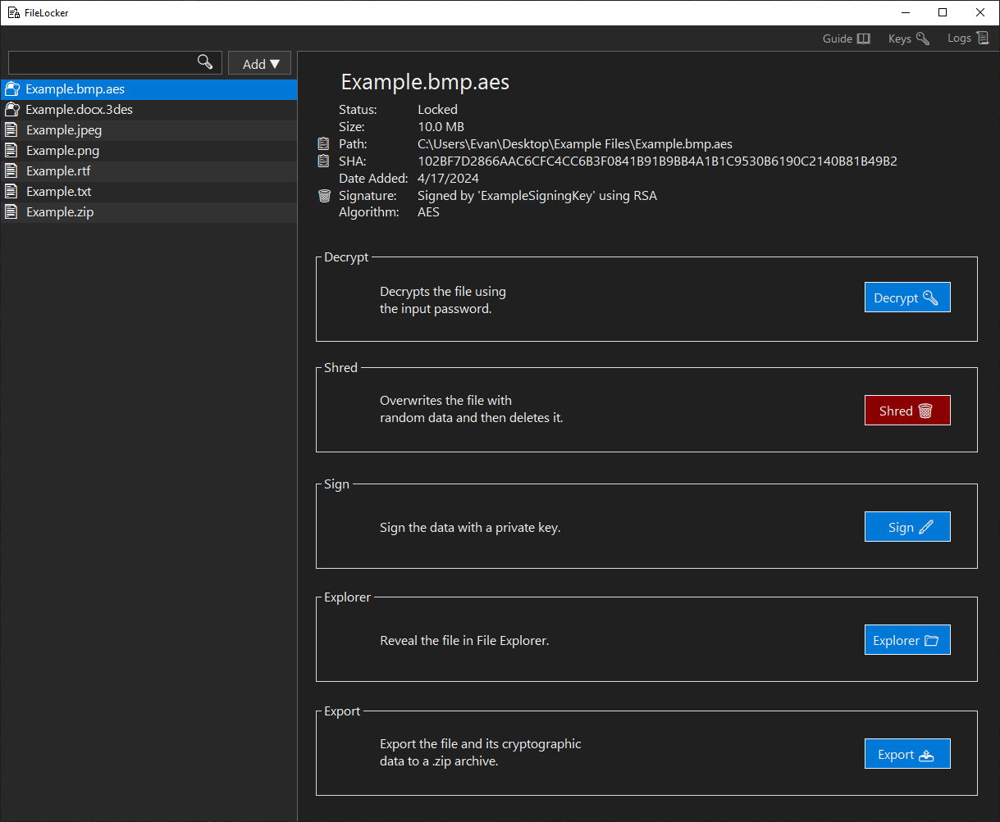
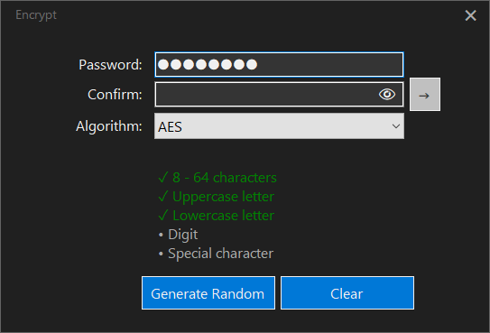

# FileLocker

A Windows desktop app for cryptographically protecting files.

## Table of Contents

1. [Getting Started](#getting-started)
2. [Guide](#guide)
3. [Technologies](#technologies)
4. [Security Features](#security-features)

## Getting Started

<strong>Download</strong>

<em>Coming Soon</em>

<strong>Installation</strong>

<em>Coming Soon</em>

## Guide

### Dashboard Form

<strong>Summary</strong>

The Dashboard Form also displays files within FileLocker's scope and allows addition and navigation of files.

- **Guide 📖**: opens the GitHub repository in the default browser.
- **Add ▼**: shows dropdown options to add files to the scope by manually selecting or importing an archive.
- **File List**: right click on a file to display options or drag and drop files onto the list to add them.
- **Search Bar**: filters files based on the search query.

> [!TIP]
> Filter by file type by searching `.txt` or `.png`, or filter by algorithm by searching `.aes` or `.3des`.

<strong>Locked File</strong>

A locked file can be decrypted, shredded, shown in File Explorer, or exported.

- **📋 Path**: copies the path to the clipboard.
- **📋 SHA**: copies the SHA to the clipboard.
- **Decrypt 🔑**: opens the Decrypt Form.
- **Shred 🗑️**: shreds the file by overwriting its contents with random data and then deleting.
- **Explorer 📁**: launches File Explorer with the file selected.
- **Export 📤**: exports the file to a .zip archive.

<strong>Unlocked File</strong>

An unlocked file can be encrypted, shredded, or shown in File Explorer.

- **📋 Path**: copies the path to the clipboard.
- **📋 SHA**: copies the SHA to the clipboard.
- **Encrypt 🔐**: opens the Encrypt Form.
- **Shred 🗑️**: shreds the file by overwriting its contents with random data and then deleting.
- **Explorer 📁**: launches File Explorer with the file selected.

<strong>Moved/Deleted File</strong>

An moved or deleted file can be relocated or removed from scope.

- **Relocate**: find the moved file.
- **Remove**: remove file from scope.

<strong>Keys</strong>

Keys pairs can be created and public keys can be imported.

- **Create**: opens the Create Key Pair Form.
- **Import**: imports a selected public key archive.
- **Key Lists**: right click on a key to display options.

---

<strong>Encrypt Form</strong>

The Encrypt Form allows encryption by choosing an industry-standard encryption algorithm such as AES or 3DES and providing a strength-enforced password. Password fields are cleared after 30 seconds of inactivity.

- **Generate Random**: generates a random password that satisfies the strength policy.
- **Clear**: erases both password fields.
- **→**: encrypts the file with the provided password.
- **👁**: shows or hides the password fields.

> [!CAUTION]
> If the password is lost, the file cannot be decrypted. FileLocker maintains a zero-knowledge policy.

---

<strong>Decrypt Form</strong>

The Decrypt Form allows decryption by providing the encryption password. Password field is cleared after 30 seconds of inactivity.

- **→**: decrypts the file with the provided password, if correct.
- **👁**: shows or hides the password fields.

---

<strong>Import Form</strong>

The Import Form allows an import of a .zip archive.

- **Open**: choose a .zip archive.
- **Save To**: the location where the file will be saved.
- **Import**: loads the archive and saves the file to the chosen location.

---

<strong>Create Key Pair Form</strong>

The Create Key Pair Form allows creation of a public/private key pair.

- **Generate Random**: generates a random password that satisfies the strength policy.
- **Clear**: erases both password fields.
- **→**: creates the key pair and encrypts the private key with the provided password.
- **👁**: shows or hides the password fields.

> [!CAUTION]
> If the password is lost, the key cannot be used to sign. FileLocker maintains a zero-knowledge policy.

---

## Technologies

- **OS**: Windows
- **IDE**: Visual Studio
- **Programming Language**: C#
- **Framework**: .NET
- **UI**: Windows Forms
- **Version Control**: Git / GitHub
- **Algorithms**: AES, 3DES, HMACSHA256, PBKDF2, RSA, ECDSA
- **Logging**: Serilog
- **Unit Testing**: xUnit

## Security Features

- **Confidentiality**: AES and 3DES encryption.
- **Integrity**: HMAC integrity checks of stored and transmitted data.
- **Password Strength Policy**: strong passwords mitigate brute-force attacks.
- **Password Generator**: passwords generated without the need to manually type, mitigating the effect of keystroke logging malware.
- **Password Management**: password inputs cleared after a set time if the device is left running.
- **Password-Based Key Derivation**: encryption keys derived from passwords.
- **Logging**: important events logged such as encryption and decryption.
- **Constant-Time Comparison**: libraries use constant-time comparison to mitigate timing attacks.
- **File Shredder**: files deleted without leaving traces by overwriting with random data.
- **Customization**: selection of different algorithms.
- **SOLID Principles**: facilitate quick code updates in the case of a new exploit.
